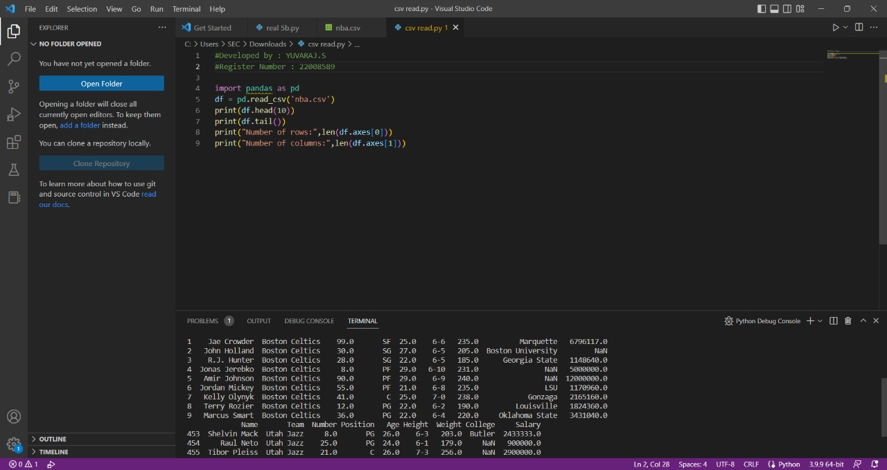
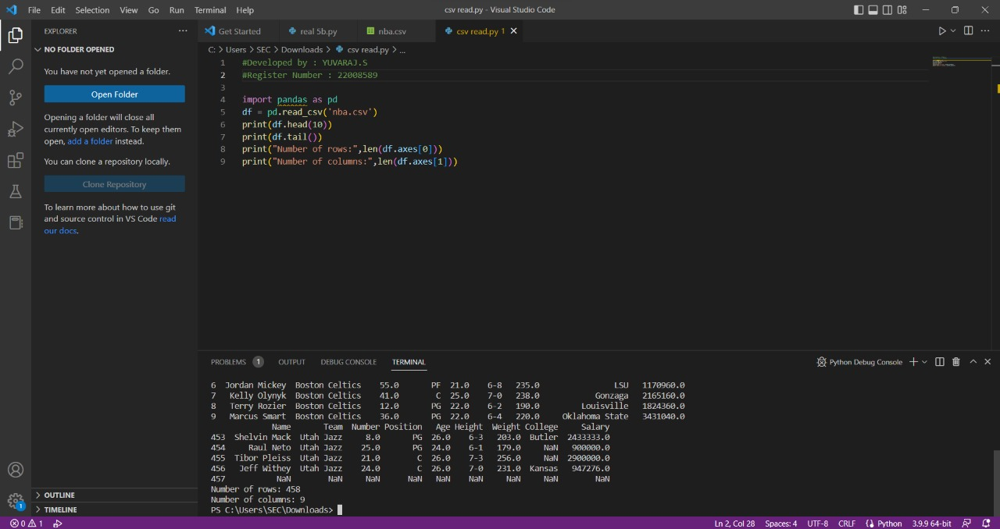

# Read-from-CSV

## AIM:
To read files from csv files using python program.
## ALGORITHM:
### Step 1:
First we want to import pandas.
### Step 2:
Then we want to create csv file.
### Step 3:
Both python and csv files are in the same folder.
### Step 4:
Then write the revalent code in the python file
### Step 5:
Then check the result.
## PROGRAM:
### To read files from csv files using python program.
```PYTHON
#Developed by : YUVARAJ.S
#Register Number : 22008589
import pandas as pd
df = pd.read_csv('nba.csv')
print(df.head(10))
print(df.tail())
print("Number of rows:",len(df.axes[0]))
print("Number of columns:",len(df.axes[1]))
```

## OUTPUT:



## RESULT:
The result for read from csv is came successfully.